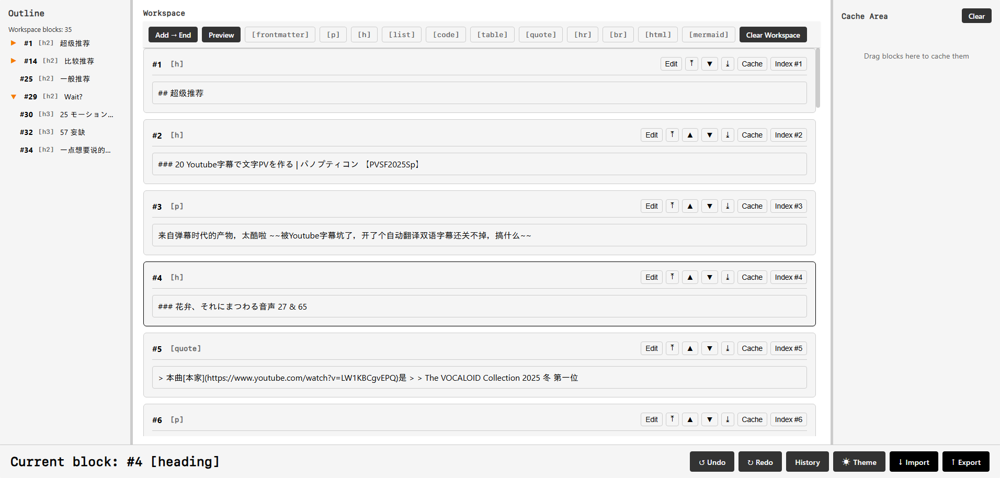

# blocky-markdown

A minimalist, framework-free markdown editor with a block-based interface and hierarchical document navigation.

<p align="center">
  
</p>

## Features

- 📑 **Hierarchical Outline** - Collapsible heading structure with level indentation
- 📐 **Resizable 3-Column Layout** - Outline | Workspace | Cache
- 🎨 **Dual Theme System** - Daytime (light) and Nightcore (dark) modes
- 📝 **Block-Based Editing** - 11 different block types
- 📊 **Enhanced Table Editor** - Split view with dedicated cell editor
- 🔗 **Link Editor Tool** - Insert links in paragraphs, lists, and tables
- 💾 **Import/Export** - Full markdown support with frontmatter
- 🔄 **Auto-Save** - Automatic localStorage persistence
- 🖱 **Hover Controls** - Per-block buttons fade in on hover (always visible on touch)
- 🚀 **No Build Required** - Pure HTML, CSS, and JavaScript as native ES modules

## Theme System

### Daytime Theme (Default)
- Clean black and white design
- Monospace fonts for clarity
- No decorative elements
- Distraction-free writing

### Nightcore Theme (Dark Mode)
- Subtle dark colors (#1A1A1A background)
- Easy on the eyes
- Good contrast for readability
- Not pure black - easier for extended use

Toggle between themes using the ☀/🌙 button in the header.

## Supported Block Types

All blocks use clean HTML-style tags (no emojis):

- `[frontmatter]` - Jekyll/Hugo YAML front matter
- `[p]` - Paragraph blocks
- `[h]` - Headings (H1-H6 with level selector)
- `[list]` - Ordered and unordered lists
- `[code]` - Code blocks with language tags
- `[table]` - Interactive table editor
- `[quote]` - Blockquotes
- `[hr]` - Horizontal rule
- `[br]` - Line break
- `[html]` - Raw HTML blocks
- `[mermaid]` - Mermaid diagram support

## Key Features

### Hierarchical Outline
- **Shows document structure** - All blocks listed with icons
- **Heading levels** - H1-H6 with proper indentation
- **Collapsible sections** - Click ▼/▶ to expand/collapse
- **Quick navigation** - Click any item to jump to that block
- **Auto-updates** - Changes reflect immediately

### Resizable Layout
- **3-Column design** - Outline | Workspace | Cache
- **Drag to resize** - Vertical dividers adjust panel widths
- **Flexible sizing** - Each sidebar: 150px min, 500px max
- **Responsive** - Collapses to vertical layout on mobile

### Enhanced Table Editor
- **Split view** - Grid (left) + Content editor (right)
- **Add/Remove rows/columns** - Dynamic without data loss
- **Cell selection** - Click to edit in dedicated textarea
- **Link insertion** - "Insert Link" button in cell editor
- **No data loss** - All operations preserve content

### Link Editor
- **Available in** - Paragraphs, lists, and table cells
- **"Insert Link" button** - Opens dedicated modal
- **Fields** - Link text, URL, and optional title
- **Cursor placement** - Inserts at current position
- **Markdown format** - Generates proper `[text](url "title")` syntax

### Block Management
- **Drag and drop** - Move blocks between workspace and cache
- **Arrow buttons** - ↑↓ for adjacent swapping; the button row appears on hover
- **Cache system** - Move blocks to cache instead of deleting
- **Permanent delete** - Only available in cache (with confirmation)
- **Visual feedback** - Border highlights show drop targets

## Usage

### 1) Import
- Serve the folder with any static file server and open it there — native ES modules do not load over `file://` (e.g. `python -m http.server` or `npx serve`). No build step.
- Click **↓ Import**, paste Markdown (frontmatter supported), confirm. Consecutive paragraphs auto-merge; history snapshot is taken.

### 2) Edit
- **Add blocks**: Toolbar tags ([p], [h], [list], etc.). Toggle **Add → Start/End** to choose insertion point.
- **Outline**: Heading-only list with level-colored toggles (shown only when children exist). Click once to toggle + jump.
- **Reorder**: Drag blocks (before/after targets); move buttons (top/up/down/bottom) or clicking the **#N** label reinsert by array order. Move to **Cache** or restore to workspace end.
- **Inline vs. focus edit**: Click block to edit inline; use **Edit/Done** for focus mode. Tip bar (bottom) shows contextual hints.
- **Preview**: Use **Preview/Edit** toggle to render the whole workspace; each block also renders its own markdown in place (Marked, with a plain-text fallback).
- **Undo/Redo**: Buttons or **Ctrl+Z / Ctrl+Y**. History limit configurable via **History** (default 100). **Clear Workspace/Cache** available. Resizers adjust outline/workspace/cache widths. Tooltips on buttons/outline/toggles/block controls.

### 3) Export
- Click **↑ Export** (or **Ctrl+S**) to open export modal; copy or download rendered Markdown.

### 4) Experience settings
- **Theme**: ☀/🌙 toggle (persists locally).
- **History limit**: Set via **History** dialog.
- **Preview toggle** and **tips bar** to monitor current action or hovered control.

## Technologies Used

- **HTML5** - Structure
- **CSS3** - Dual theme with CSS variables
- **JavaScript (ES Modules)** - Application logic, loaded natively with no build step
- **Marked.js** - Markdown parsing (with fallback)
- **DOMPurify** - Sanitizes HTML before it enters the preview pane
- **Mermaid.js** - Renders mermaid diagrams in the preview (lazy-loaded when needed)

## Browser Compatibility

Works in all modern browsers supporting:
- Native ES modules
- CSS Grid and Flexbox
- CSS Custom Properties
- LocalStorage API
- Drag and Drop API
- Mouse Events (for resizing)

## Design Philosophy

**Minimalist First**: Clean tag-based UI without decorative emojis. Focus on content, not chrome.

**Hierarchical Navigation**: Large documents need structure. Collapsible outline makes navigation effortless.

**Flexible Workspace**: Adjustable panels let you customize your writing environment.

**No Surprises**: Blocks move to cache instead of immediate deletion. Undo by dragging back.

## Development

Unit tests for the markdown parsing logic use the Node.js built-in test
runner (Node 18+, no dependencies):

```bash
node --test
```

## License

MIT License - See LICENSE file for details

## About

A local markdown editor for writers who want block-based editing with powerful navigation and a clean, professional interface. No frameworks, no complexity—just open and write.
